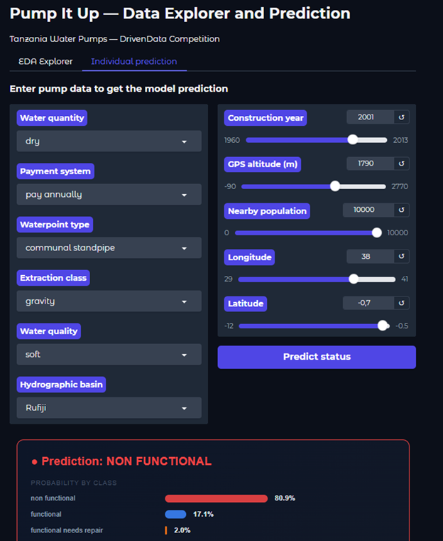

# Machine Learning Pipeline for Water Infrastructure Prediction and Agentic Exploratory Data Analysis using AI

A full predictive maintenance pipeline for ~59,000 water pumps in Tanzania (DrivenData's "Pump It Up" competition), combining classic ML (Random Forest, Extra Trees, Gradient Boosting, Stacking Ensembles) with four dedicated strategies for detecting the most operationally critical class — **pumps that need repair** — and two AI-powered interactive tools: an **agentic EDA assistant** (LangGraph + Claude) and a **conversational "Ask the Project" assistant** that lets non-technical stakeholders query the pipeline's results in natural language.

---

## The Real Problem: Catching Pumps Before They Break Down

Overall accuracy is a misleading metric here. With three classes — `functional` (54.3%), `non functional` (38.4%) and `functional needs repair` (7.3%) — a model can achieve high accuracy by nearly ignoring the minority class entirely. But that minority class is the most operationally valuable one.

**`functional needs repair` pumps are the only ones that can still be saved with a timely intervention.** A pump already labelled `non functional` requires far more expensive remediation or full replacement. Missing a pump that needs repair means it will eventually fail completely — affecting community water access and driving up maintenance costs.

The four standard base models only detect between 27% and 31% of `functional needs repair` pumps. That means roughly **7 out of every 10 repairable pumps go undetected**, are classified as functional, and receive no maintenance. This is the problem the full modelling strategy is designed to fix.

---

## Live Demos

| Demo | What it does |
|---|---|
| **Annex B – Data Explorer & Prediction** (Gradio, port 7860) | Interactive EDA explorer + individual pump prediction tool. Enter a pump's characteristics and get a live prediction with class probabilities. |
| **Annex C – "Ask the Project" AI Assistant** (Gradio, port 7862) | Conversational assistant (Claude via Anthropic API) that answers questions about the dataset, the modelling decisions and the results — a natural-language interface to the whole analysis. |

**Data Explorer & Prediction**



**"Ask the Project" AI Assistant**


---

## Project Architecture

```
┌─────────────────────────────────────────────────────────────────────────┐
│                        DATA SOURCES                                     │
│          DrivenData — Pump It Up: Data Mining the Water Table           │
│     train_features.csv · train_labels.csv · test_features.csv           │
└────────────────────────────┬────────────────────────────────────────────┘
                             │
                             ▼
┌─────────────────────────────────────────────────────────────────────────┐
│                  EXPLORATORY DATA ANALYSIS (EDA)                        │
│                                                                         │
│   ┌─────────────────┐   ┌──────────────────┐   ┌──────────────────┐     │
│   │ Class imbalance │   │ Missing values   │   │ Geographic       │     │
│   │ analysis        │   │ & zero-masking   │   │ distribution     │     │
│   └─────────────────┘   └──────────────────┘   └──────────────────┘     │
│   ┌─────────────────┐   ┌──────────────────┐                            │
│   │ High-cardinality│   │ Categorical vs   │                            │
│   │ variables       │   │ target patterns  │                            │
│   └─────────────────┘   └──────────────────┘                            │
│                                                                         │
│   Automated report: Sweetviz HTML · Agentic EDA: LangGraph + Claude     │
└────────────────────────────┬────────────────────────────────────────────┘
                             │
                             ▼
┌─────────────────────────────────────────────────────────────────────────┐
│                     FEATURE ENGINEERING                                 │
│                                                                         │
│  pump_age · log_population · log_amount_tsh · region_fail_rate          │
│  qty_pay_combo · has_scheme_mgmt · construction_decade                  │
│  Top-50 cardinality reduction · Train-only imputation medians           │
└────────────────────────────┬────────────────────────────────────────────┘
                             │
                             ▼
┌─────────────────────────────────────────────────────────────────────────┐
│                        MODELLING                                        │
│                                                                         │
│  ┌──────────────┐  ┌──────────────┐  ┌──────────────┐                   │
│  │ Random       │  │ Extra Trees  │  │ Gradient     │                   │
│  │ Forest       │  │              │  │ Boosting     │                   │
│  └──────┬───────┘  └──────┬───────┘  └──────┬───────┘                   │
│         └─────────────────┼─────────────────┘                           │
│                           │ Stacking Ensemble                           │
│                           ▼                                             │
│              ┌────────────────────────┐                                 │
│              │  LogisticRegression    │                                 │
│              │  Meta-learner (OOF)    │                                 │
│              └────────────────────────┘                                 │
│                                                                         │
│  ▼ Minority class strategies (needs repair detection)                   │
│  ┌───────────────────┐  ┌───────────────────┐  ┌───────────────────┐    │
│  │ Threshold tuning  │  │ Two-stage model   │  │ Cost-sensitive    │    │
│  └───────────────────┘  └───────────────────┘  └───────────────────┘    │
│                           │                                             │
│                           ▼                                             │
│              ┌────────────────────────┐                                 │
│              │  Weighted Voting       │                                 │
│              │  Ensemble (final)      │                                 │
│              └────────────────────────┘                                 │
└────────────────────────────┬────────────────────────────────────────────┘
                             │
                             ▼
┌─────────────────────────────────────────────────────────────────────────┐
│                     EVALUATION & OUTPUT                                 │
│                                                                         │
│   Accuracy · Macro-F1 · Recall(functional needs repair) ← primary       │
│   submission_*.csv  →  DrivenData leaderboard: 0.8230                   │
└─────────────────────────────────────────────────────────────────────────┘
                             │
                             ▼
┌─────────────────────────────────────────────────────────────────────────┐
│              INTERACTIVE LAYER (Gradio + Claude)                        │
│                                                                         │
│   Annex B: EDA Explorer & Individual Prediction (port 7860)             │
│   Annex C: "Ask the Project" — conversational AI assistant (port 7862)  │
└─────────────────────────────────────────────────────────────────────────┘
```

---

## Repository Structure

```
MachineLearning_Pipeline_WaterInfrastructure_Agentic_EDA/
│
├── pump_it_up.ipynb              # Main notebook — full ML pipeline + Annex B & C
├── ib_style.py                   # Brand styling module (plots, Gradio themes, HTML reports)
│
├── train_test_data/              # Competition data (not tracked by Git)
│   ├── train_features.csv
│   ├── train_labels.csv
│   ├── test_features.csv
│   └── submission_format.csv
│
├── submissions/                  # Generated prediction files
│   ├── submission_modelo_base.csv
│   ├── submission_pump_it_up.csv
│   ├── submission_stacking.csv
│   ├── submission_threshold.csv
│   ├── submission_dos_etapas.csv
│   ├── submission_cost_sensitive.csv
│   └── submission_ensemble_votacion.csv   ← final submission (0.8230)
│
├── images/                        # Figures generated by the notebook
│   ├── fig_target_distribution.png
│   ├── fig_missings.png
│   ├── fig_cat_stacked.png
│   ├── fig_cat_vs_target.png
│   ├── fig_geo.png
│   ├── fig_numeric_distributions.png
│   ├── fig_num_anomalies.png
│   ├── fig_pump_age_distribution.png
│   ├── fig_feature_importance_baseline.png
│   ├── fig_feature_importance_optimized.png
│   ├── fig_feature_importance_interp.png
│   ├── fig_low_importance.png
│   ├── fig_automl_comparison.png
│   ├── fig_cm_baseline.png
│   ├── fig_cm_comparison.png
│   ├── fig_model_comparison.png
│   ├── fig_stacking_comparison.png
│   ├── fig_threshold_tuning.png
│   ├── fig_repair_recall_comparison.png
│   ├── fig_ensemble_votacion.png
│   └── fig_summary.png
│
├── .env                           # API key — never committed to Git
├── .gitignore                     # Excludes .env, data, outputs
└── README.md
```

> **Note:** `train_test_data/` and `.env` must be added to `.gitignore` and are not included in this repository. `ib_style.py` must sit in the same folder as the notebook — if it's missing, the notebook falls back to default (unstyled) plots without breaking execution.

---

## Recommended `.gitignore`

```gitignore
# Environment variables — never commit API keys
.env

# Competition data
train_test_data/

# Notebook outputs and checkpoints
.ipynb_checkpoints/
__pycache__/

# Generated HTML reports
eda_report_*.html

# OS files
.DS_Store
Thumbs.db
```

---

## Business Problem

Thousands of water pumps across Tanzania operate under limited maintenance resources and difficult geographical conditions. The challenge is not only identifying which pumps are broken — it is identifying which ones are **about to break** while there is still time to intervene.

The three-class problem makes this deceptively hard:

| Class | Share | Operational meaning |
|---|---|---|
| `functional` | 54.3% | No action needed |
| `non functional` | 38.4% | Already broken — expensive remediation |
| `functional needs repair` | **7.3%** | **Repairable now — highest ROI for maintenance** |

The `functional needs repair` class is small but disproportionately valuable. A model that ignores it to maximize overall accuracy is operationally useless: it tells maintenance teams where the broken pumps are (already known) but misses the ones that can still be saved cheaply.

The goal of this project is to build a solution that maximizes detection of `functional needs repair` pumps while maintaining globally acceptable accuracy — and to make those findings accessible through interactive tools.

---

## Dataset Overview

The dataset contains operational and administrative information for over 59,000 water pumps installed across Tanzania.


---

## Methodology

The project follows a CRISP-DM inspired workflow, structured around two parallel objectives: maximizing global classification performance and specifically maximizing recall on the `functional needs repair` class.

### 1. Exploratory Data Analysis (EDA)

Main challenges identified during analysis:

**Severely imbalanced target classes — the core modelling challenge**


**Missing values represented as zeros**


**High-cardinality categorical variables**


**Strong geographical patterns — predictive signal for regional risk**


**Sparse maintenance information**


An automated **Sweetviz** HTML report and an **agentic EDA pipeline (LangGraph + Claude)** were also produced, allowing the dataset to be explored and summarized through natural-language queries.

---

### 2. Data Preparation & Feature Engineering

All imputation statistics (medians, target-encoding maps, cardinality vocabularies) are fit exclusively on the training set to prevent data leakage.

#### Feature Engineering

| Feature | Type | Business Purpose |
|---|---|---|
| `pump_age` | Derived | Infrastructure aging — older pumps fail more |
| `construction_decade` | Derived | Technological lifecycle segmentation |
| `log_population` | Transformed | Population normalization (skew reduction) |
| `log_amount_tsh` | Transformed | Flow normalization (skew reduction) |
| `region_fail_rate` | Target encoded | Regional failure risk — strong predictor |
| `qty_pay_combo` | Interaction | Water availability vs payment behaviour |
| `has_scheme_mgmt` | Binary flag | Operational governance indicator |


#### Cardinality Management

High-cardinality variables (`funder`, `installer`, `lga`) are reduced to their Top-50 most frequent values; all others are mapped to `other` before encoding. Columns with extreme cardinality and low net gain (`wpt_name`, `subvillage`, `ward`, `scheme_name`) are dropped.

---

### 3. Machine Learning Models — From Simple to Complex

Multiple approaches were evaluated in increasing order of complexity:

- Random Forest (baseline and optimised)
- Extra Trees
- Gradient Boosting
- HistGradientBoosting
- AutoML (RandomizedSearchCV)
- Stacking Ensemble (RF + ET + GBT → LogisticRegression meta-learner)


The stacking ensemble reaches **0.8114 accuracy** — but none of these models meaningfully improve detection of `functional needs repair`. The following phase specifically targets this gap.

---

### 4. Minority Class Strategies — The Key Engineering Challenge

Standard models detect only 27–31% of `functional needs repair` pumps. Four dedicated strategies were designed, each with an explicit trade-off:

| Strategy | Needs Repair Detection | Global Accuracy | Trade-off |
|---|---|---|---|
| **Threshold tuning** | ~81.5% recall | ~70% | Best detection, too many false positives |
| **Two-stage model** | Moderate improvement | Minimal loss | Balanced; two separate classifiers |
| **Cost-sensitive learning** | Moderate improvement | Minimal loss | Single model, penalty-weighted |
| **Weighted voting ensemble** | ~6.7% predicted (vs 7.3% real) | **0.8230** | Best overall balance — **final solution** |


**Why threshold tuning was not chosen as the final solution:** it achieves the highest raw recall (81.5%) but at an unacceptable cost — global precision drops from ~81% to ~70%. Marking too many functional pumps as needing repair generates excessive unnecessary inspections, which defeats the operational purpose. The recall/precision trade-off must remain manageable in practice.

**Why the weighted voting ensemble is the final solution:** it combines all five submission files with class-specific weights, bringing the predicted share of `functional needs repair` pumps to 6.7% — very close to the true 7.3% — while maintaining the best leaderboard score of **0.8230**.


---

## Model Performance

| Model | Accuracy | Notes |
|---|---|---|
| Random Forest Baseline | 0.8076 | Starting point |
| Optimised Random Forest | 0.8102 | Feature engineering applied |
| AutoML (RandomizedSearchCV) | 0.8104 | Hyperparameter search |
| Stacking Ensemble | 0.8114 | RF + ET + GBT meta-learner |
| **Weighted Voting Ensemble** | **0.8230** | **Final — best needs-repair detection** |


> The 1.2 pp accuracy gain from stacking to the final ensemble understates the real improvement. The key metric is the predicted class distribution: the final ensemble estimates 6.7% of pumps as needing repair, versus 2.5–3.2% from base models — a more than twofold improvement in detection of the operationally critical class.

---

## Key Business Insights

### 🌍 Geographic Risk Patterns

Southern regions such as Lindi (64%) and Mtwara (62%) show significantly higher failure rates than northern areas like Arusha (26%) or Iringa (19%). This enables geographically targeted maintenance investment rather than uniform resource allocation.

### 🔧 Infrastructure Aging

Pumps older than 20 years fail substantially more often. Infrastructure age is one of the strongest predictors in the model — enabling lifecycle-based maintenance prioritization before failure occurs.

### 💧 Water Availability & Failure Correlation

Pumps in low-water regions are considerably more likely to become non-functional, reflecting both environmental stress and reduced maintenance incentives when water demand appears lower.

### 💰 Financial Sustainability Impact

The absence of payment systems strongly correlates with infrastructure failure. Communities without maintenance funding mechanisms experience significantly higher operational degradation — pointing to governance and financial sustainability as root causes, not just technical factors.

### 🏢 Operational Management Quality

Infrastructure managed by undefined or weak governance entities shows consistently worse operational performance than systems under formal organizational management.

---

## Interactive Layer

### Annex B — Data Explorer & Individual Predictor (Gradio, port 7860)

A fully interactive EDA and prediction interface. Any user — without touching code — can explore the dataset and enter a pump's characteristics to get a live prediction with the probability of each class. Built with the project's brand styling (`ib_style.py`).

### Annex C — "Ask the Project" AI Assistant (Gradio, port 7862)

A conversational assistant powered by the Anthropic Claude API. Users can ask questions in natural language — for example, "how many pumps need repair in Lindi?" — and receive answers grounded in the actual analysis results, by region and class. Designed to make the model's findings accessible to non-technical stakeholders.

---

## Technical Skills Demonstrated

- Machine Learning & Predictive Analytics
- Imbalanced Dataset Handling (threshold tuning, cost-sensitive learning, ensemble voting)
- Feature Engineering & Data Cleaning (leakage-free pipelines)
- Stacking Ensembles & Meta-learners
- Agentic AI Pipelines (LangGraph + Claude)
- Interactive Demos & Conversational Interfaces (Gradio + Anthropic API)
- Classification, SHAP Interpretability & Business Intelligence Translation
- Python Data Stack (pandas, numpy, sklearn, matplotlib, seaborn)
- Personal brand visual system (`ib_style.py`) applied across all outputs

---

## Setup & Reproducibility

### Requirements

```bash
pip install -r requirements.txt
```

### Environment Variables

This project requires an Anthropic API key for the agentic EDA (LangGraph) and the "Ask the Project" assistant (Annex C). Create a `.env` file in the project root:

```
ANTHROPIC_API_KEY=your_api_key_here
```

The key is loaded automatically by the notebook via `python-dotenv`. It is never stored in the code.

### Running the Notebook

1. Clone the repository
2. Make sure `ib_style.py` is in the same folder as `pump_it_up.ipynb`
3. Place the competition CSV files in `train_test_data/`
4. Create your `.env` file with your Anthropic API key
5. Run `pip install -r requirements.txt`
6. Open `pump_it_up.ipynb` and run all cells in order (`Kernel → Restart & Run All`)

### Launching the Interactive Demos

Running the notebook's final cells launches two local Gradio apps:

- **Annex B** — `http://127.0.0.1:7860` — EDA Explorer and individual pump prediction
- **Annex C** — `http://127.0.0.1:7862` — "Ask the Project" conversational assistant (requires `ANTHROPIC_API_KEY`)

---

## Strategic Conclusions

The central lesson of this project is that **optimizing for overall accuracy in an imbalanced classification problem can actively mislead you**. A model with 81% accuracy that ignores 70% of the repairable pumps is worse for operational purposes than a slightly less accurate model that finds most of them.

The final solution does not just achieve the best leaderboard score (0.8230). It distributes its predictions in a way that closely mirrors reality — detecting 6.7% of pumps as needing repair versus the true 7.3% — making it a tool that can actually support maintenance prioritization rather than just score well on a metric.

Beyond the model, the project demonstrates how the combination of interpretability (SHAP, geographic analysis) and productivization (Gradio interfaces, conversational AI assistant) can close the gap between a data science result and a decision-support tool usable by non-technical stakeholders.

**Potential extensions:** risk-based maintenance scheduling, regional infrastructure investment planning, governance optimization, geospatial clustering, calibrated ensemble architectures, and integration with field operations systems.
