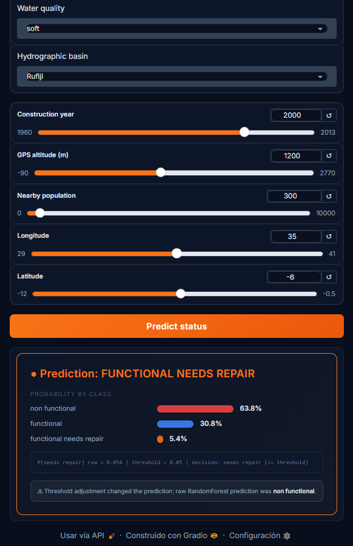
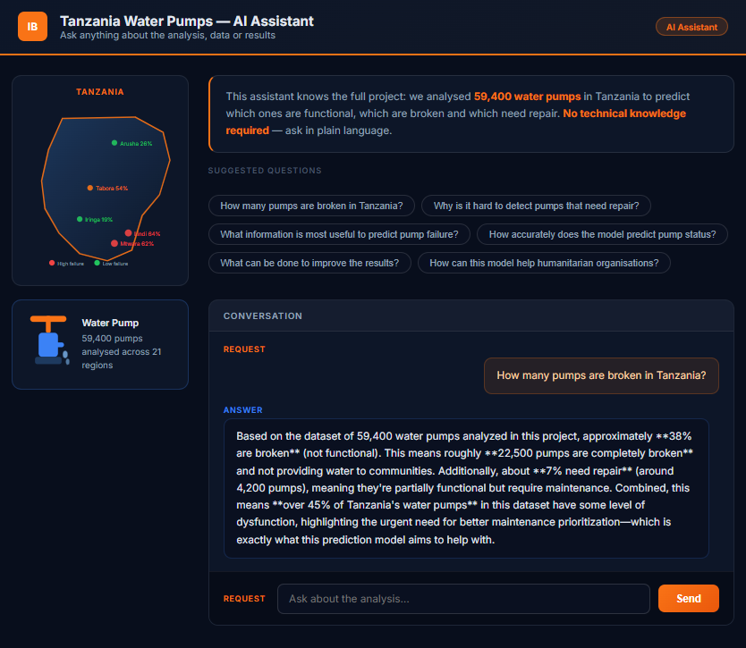
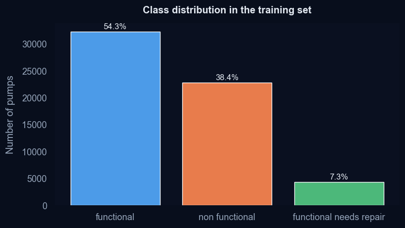
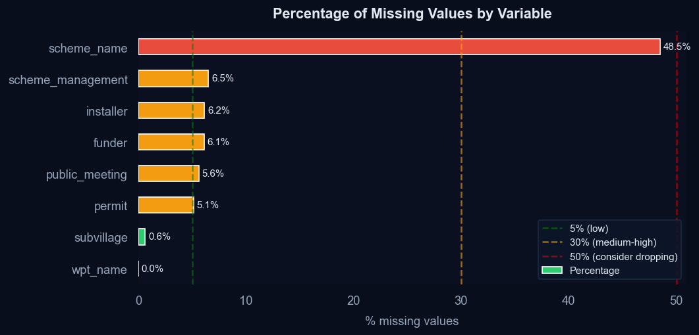
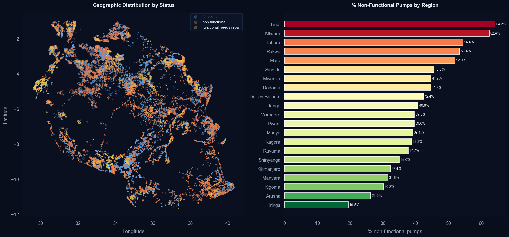
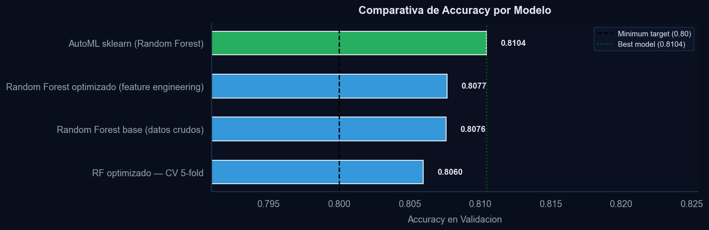
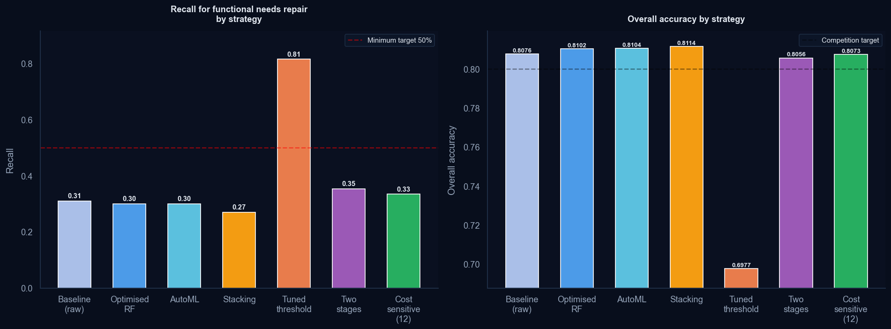
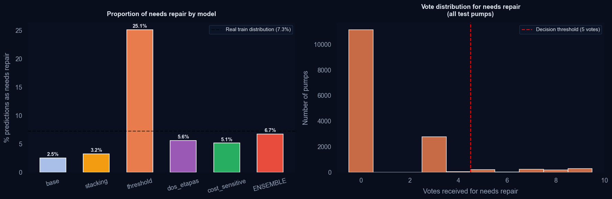
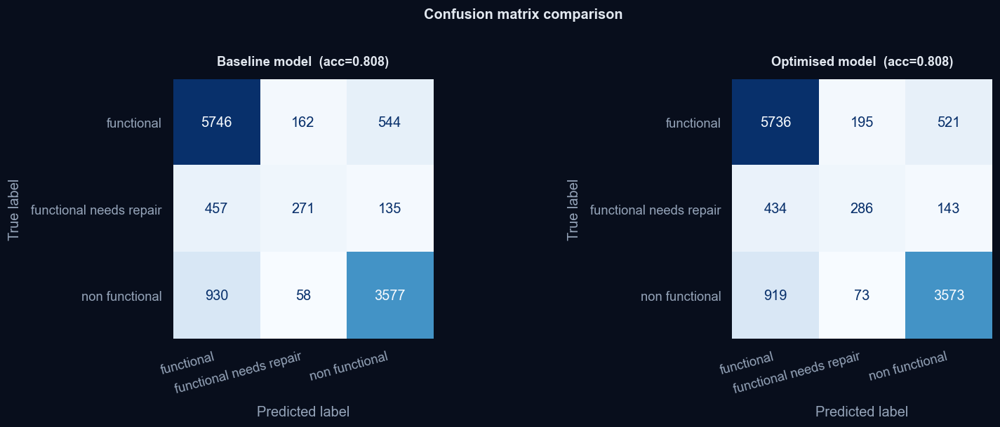

# Machine Learning Pipeline for Water Infrastructure Prediction and Agentic Exploratory Data Analysis using AI

A full predictive maintenance pipeline for ~59,000 water pumps in Tanzania (DrivenData's "Pump It Up" competition), combining classic ML (Random Forest, Extra Trees, Gradient Boosting, Stacking Ensembles) with four dedicated strategies for detecting the most operationally critical class — **pumps that need repair** — and two AI-powered interactive tools: an **agentic EDA assistant** (LangGraph + Claude) and a **conversational "Ask the Project" assistant** that lets non-technical stakeholders query the pipeline's results in natural language.

---

## The Real Problem: Catching Pumps Before They Break Down

Overall accuracy is a misleading metric here. With three classes — `functional` (54.3%), `non functional` (38.4%) and `functional needs repair` (7.3%) — a model can achieve high accuracy by nearly ignoring the minority class entirely. But that minority class is the most operationally valuable one.

**`functional needs repair` pumps are the only ones that can still be saved with a timely intervention.** A pump already labelled `non functional` requires far more expensive remediation or full replacement. Missing a pump that needs repair means it will eventually fail completely — affecting community water access and driving up maintenance costs.

The four standard base models only detect between 27% and 31% of `functional needs repair` pumps. That means roughly **7 out of every 10 repairable pumps go undetected**, are classified as functional, and receive no maintenance. This is the problem the full modelling strategy is designed to fix.

---

## The Pipeline in Three Notebooks

The project is structured as a three-stage pipeline. Each notebook is self-contained, GitHub-renderable, and hands off its outputs to the next through the `00_artifacts/` folder:

```
┌──────────────────────────┐     ┌──────────────────────────┐     ┌──────────────────────────┐
│  01_data_preparation     │     │  02_model_training       │     │  03_interactive_annexes  │
│                          │     │                          │     │                          │
│  · Data loading          │ ──▶ │  · Baseline (raw data)   │ ──▶ │  · Annex A — LangGraph   │
│  · Full EDA (9 sections) │     │  · Optimised RF + CV     │     │    EDA agent (:7861)     │
│  · Sweetviz report       │     │  · Interpretability      │     │  · Annex B — Explorer &  │
│  · Feature engineering   │     │  · AutoML + Stacking     │     │    Predictor (:7860)     │
│  · feature_pipeline.py   │     │  · 4 minority-class      │     │  · Annex C — "Ask the    │
│                          │     │    strategies            │     │    Project" (:7862)      │
│  artifacts:              │     │  · Final ensemble 0.8230 │     │                          │
│  X_eng · X_test_eng · y  │     │                          │     │  consumes: model +       │
│  feature_artifacts.pkl   │     │  artifacts: rf_final     │     │  pipeline + threshold    │
│                          │     │  model_config (BEST_THR) │     │                          │
└──────────────────────────┘     └──────────────────────────┘     └──────────────────────────┘
```

| Notebook | Documentation | Runtime |
|---|---|---|
| [`01_data_preparation.ipynb`](01_executables/01_data_preparation.ipynb) | [README](01_executables/01_data_preparation_README.md) | ~2–3 min |
| [`02_model_training.ipynb`](01_executables/02_model_training.ipynb) | [README](01_executables/02_model_training_README.md) | ~15–40 min |
| [`03_interactive_annexes.ipynb`](01_executables/03_interactive_annexes.ipynb) | [README](01_executables/03_interactive_annexes_README.md) | seconds (servers stay alive) |

**Why three notebooks?** The original single notebook exceeded GitHub's render limit and mixed three different concerns. The split follows the natural pipeline boundaries — data, models, product — with an explicit artifact contract between stages: `feature_pipeline.py` is generated once in notebook 01 and imported by notebook 03, so the live predictor applies byte-identical preprocessing to what the models were trained on.

---

## Live Demos

| Demo | What it does |
|---|---|
| **Annex B – Data Explorer & Prediction** (Gradio, port 7860) | Interactive EDA explorer + individual pump prediction tool. Enter a pump's characteristics and get a live prediction with class probabilities. |
| **Annex C – "Ask the Project" AI Assistant** (port 7862) | Conversational assistant (Claude via Anthropic API) that answers questions about the dataset, the modelling decisions and the results — a natural-language interface to the whole analysis. |

**Data Explorer & Prediction**



**"Ask the Project" AI Assistant**



---

## Repository Structure

The repository is organised into numbered folders that follow the pipeline order — from the raw data and generated artifacts, through the executable notebooks, to the submissions, reports and figures they produce.

```
MachineLearning_Pipeline_WaterInfrastructure_Agentic_EDA/
│
├── 00_train_test_data/                # Competition data (input)
│   ├── train_features.csv
│   ├── train_labels.csv
│   ├── test_features.csv
│   └── submission_format.csv
│
├── 00_artifacts/                      # Pipeline handoff between notebooks
│   ├── X_eng.parquet                  #   01 -> 02, 03
│   ├── X_test_eng.parquet             #   01 -> 02
│   ├── y.parquet                      #   01 -> 02
│   ├── feature_artifacts.pkl          #   01 -> 03
│   ├── rf_final.joblib                #   02 -> 03
│   └── model_config.json              #   02 -> 03 (tuned threshold)
│
├── 01_executables/                    # The three-stage pipeline
│   ├── 01_data_preparation.ipynb      #   Part 1 - EDA + feature engineering
│   ├── 01_data_preparation_README.md
│   ├── 02_model_training.ipynb        #   Part 2 - models, strategies, submissions
│   ├── 02_model_training_README.md
│   ├── 03_interactive_annexes.ipynb   #   Part 3 - Gradio demos + AI assistants
│   ├── 03_interactive_annexes_README.md
│   ├── ib_style.py                    #   Brand styling module (plots, Gradio, HTML)
│   └── feature_pipeline.py            #   Generated by notebook 01 - single source
│                                      #   of truth for the feature transformation
│
├── 02_submissions/                    # Generated prediction files
│   ├── submission_modelo_base.csv
│   ├── submission_pump_it_up.csv
│   ├── submission_stacking.csv
│   ├── submission_threshold.csv
│   ├── submission_dos_etapas.csv
│   ├── submission_cost_sensitive.csv
│   └── submission_ensemble_votacion.csv   <- final submission (0.8230)
│
├── 04_html_eda/                       # Automated EDA reports (Sweetviz HTML)
│
├── 05_images/                         # Figures generated by the notebooks
│
├── .env                               # API key - never committed to Git
├── .gitignore
└── README.md
```

> **Path note.** The notebooks resolve `00_train_test_data/` and `00_artifacts/`
> automatically by walking up from the notebook location, so they run correctly
> from inside `01_executables/`. Figures are written to `05_images/` and the
> Sweetviz report to `04_html_eda/`.

### Recommended `.gitignore`

```gitignore
# Environment variables - never commit API keys
.env

# Notebook checkpoints and caches
.ipynb_checkpoints/
__pycache__/

# OS files
.DS_Store
Thumbs.db

# Note: 00_artifacts/ is kept in the repo so notebooks 02 and 03 can be
# reviewed without re-running notebook 01. Remove the folder from tracking
# if you prefer to regenerate it locally each time.
```

---

## Business Problem

Thousands of water pumps across Tanzania operate under limited maintenance resources and difficult geographical conditions. The challenge is not only identifying which pumps are broken — it is identifying which ones are **about to break** while there is still time to intervene.

| Class | Share | Operational meaning |
|---|---|---|
| `functional` | 54.3% | No action needed |
| `non functional` | 38.4% | Already broken — expensive remediation |
| `functional needs repair` | **7.3%** | **Repairable now — highest ROI for maintenance** |

The `functional needs repair` class is small but disproportionately valuable. A model that ignores it to maximize overall accuracy is operationally useless: it tells maintenance teams where the broken pumps are (already known) but misses the ones that can still be saved cheaply.


---

## Methodology

The project follows a CRISP-DM inspired workflow, structured around two parallel objectives: maximizing global classification performance and specifically maximizing recall on the `functional needs repair` class.

### Part 1 — Exploratory Data Analysis & Feature Engineering

Main challenges identified (full detail in [Part 1's README](01_executables/01_data_preparation_README.md)):

**Severely imbalanced target classes**



**Missing values represented as zeros**



**Strong geographical patterns — predictive signal for regional risk**



All imputation statistics (medians, target-encoding maps, cardinality vocabularies) are fit exclusively on the training set to prevent data leakage.

| Feature | Type | Business Purpose |
|---|---|---|
| `pump_age` | Derived | Infrastructure aging — older pumps fail more |
| `log_population` / `log_amount_tsh` | Transformed | Skew reduction |
| `region_fail_rate` | Target encoded | Regional failure risk — strong predictor |
| `qty_pay_combo` | Interaction | Water availability vs payment behaviour |
| Top-50 reduction | Cardinality | `funder` / `installer` / `lga` |

### Part 2 — Models: From Simple to Complex

Full detail in [Part 2's README](01_executables/02_model_training_README.md).



The stacking ensemble reaches **0.8114 accuracy** — but none of the standard models meaningfully improve detection of `functional needs repair`. Four dedicated strategies attack that gap:

| Strategy | Needs Repair Detection | Global Accuracy | Trade-off |
|---|---|---|---|
| Threshold tuning | ~81.5% recall | ~70% | Best detection, too many false positives |
| Two-stage model | Moderate improvement | Minimal loss | Balanced; two separate classifiers |
| Cost-sensitive learning | Moderate improvement | Minimal loss | Single model, penalty-weighted |
| **Weighted voting ensemble** | ~6.7% predicted (vs 7.3% real) | **0.8230** | **Best overall balance — final solution** |



**Why the weighted voting ensemble wins:** it combines all five submission files with class-specific weights, bringing the predicted share of `functional needs repair` pumps to 6.7% — very close to the true 7.3% — while achieving the best leaderboard score of **0.8230**.



### Part 3 — Interactive Layer

Full detail in [Part 3's README](01_executables/03_interactive_annexes_README.md). Three local web interfaces make the results usable by non-technical stakeholders — and the live predictor imports the exact `feature_pipeline.py` generated in Part 1, guaranteeing prediction consistency with the trained models.

---

## Model Performance

| Model | Accuracy | Notes |
|---|---|---|
| Random Forest Baseline | 0.8076 | Starting point |
| Optimised Random Forest | 0.8102 | Feature engineering applied |
| AutoML (RandomizedSearchCV) | 0.8104 | Hyperparameter search |
| Stacking Ensemble | 0.8114 | RF + ET + GBT meta-learner |
| **Weighted Voting Ensemble** | **0.8230** | **Final — best needs-repair detection** |



> The 1.2 pp accuracy gain from stacking to the final ensemble understates the real improvement. The key metric is the predicted class distribution: the final ensemble estimates 6.7% of pumps as needing repair, versus 2.5–3.2% from base models — a more than twofold improvement in detection of the operationally critical class.

---

## Key Business Insights

### 🌍 Geographic Risk Patterns

Southern regions such as Lindi (64%) and Mtwara (62%) show significantly higher failure rates than northern areas like Arusha (26%) or Iringa (19%). This enables geographically targeted maintenance investment rather than uniform resource allocation.

### 🔧 Infrastructure Aging

Pumps older than 20 years fail substantially more often. Infrastructure age is one of the strongest predictors in the model — enabling lifecycle-based maintenance prioritization before failure occurs.

### 💧 Water Availability & Failure Correlation

Pumps in low-water regions are considerably more likely to become non-functional, reflecting both environmental stress and reduced maintenance incentives when water demand appears lower.

### 💰 Financial Sustainability Impact

The absence of payment systems strongly correlates with infrastructure failure. Communities without maintenance funding mechanisms experience significantly higher operational degradation — pointing to governance and financial sustainability as root causes, not just technical factors.

### 🏢 Operational Management Quality

Infrastructure managed by undefined or weak governance entities shows consistently worse operational performance than systems under formal organizational management.

---

## Technical Skills Demonstrated

- Machine Learning & Predictive Analytics
- Imbalanced Dataset Handling (threshold tuning, cost-sensitive learning, ensemble voting)
- Feature Engineering & Data Cleaning (leakage-free pipelines)
- Pipeline design with explicit artifact contracts between stages
- Stacking Ensembles & Meta-learners
- Agentic AI Pipelines (LangGraph + Claude)
- Interactive Demos & Conversational Interfaces (Gradio + Anthropic API)
- Classification, Interpretability & Business Intelligence Translation
- Python Data Stack (pandas, numpy, sklearn, matplotlib, seaborn)
- Personal brand visual system (`ib_style.py`) applied across all outputs

---

## Setup & Reproducibility

### Requirements

```bash
pip install -r requirements.txt
```

### Environment Variables

Annexes A and C (notebook 03) require an Anthropic API key. Create a `.env` file inside `01_executables/` (next to the notebooks):

```
ANTHROPIC_API_KEY=your_api_key_here
```

The key is loaded automatically via `python-dotenv` and is never stored in the code.

### Running the Pipeline

1. Clone the repository
2. Place the competition CSVs in `00_train_test_data/`
3. Keep `ib_style.py` inside `01_executables/` next to the notebooks (optional — they fall back to default styling)
4. Run the notebooks **in order**:
   1. `01_data_preparation.ipynb` — produces `00_artifacts/` and `feature_pipeline.py`
   2. `02_model_training.ipynb` — produces submissions and the final model
   3. `03_interactive_annexes.ipynb` — launches the three interactive demos

### Launching the Interactive Demos

Running notebook 03 launches three local servers:

- **Annex A** — `http://127.0.0.1:7861` — LangGraph EDA agent (requires API key)
- **Annex B** — `http://127.0.0.1:7860` — EDA Explorer and individual pump prediction
- **Annex C** — `http://127.0.0.1:7862` — "Ask the Project" conversational assistant (requires API key)

---

## Strategic Conclusions

The central lesson of this project is that **optimizing for overall accuracy in an imbalanced classification problem can actively mislead you**. A model with 81% accuracy that ignores 70% of the repairable pumps is worse for operational purposes than a slightly less accurate model that finds most of them.

The final solution does not just achieve the best leaderboard score (0.8230). It distributes its predictions in a way that closely mirrors reality — detecting 6.7% of pumps as needing repair versus the true 7.3% — making it a tool that can actually support maintenance prioritization rather than just score well on a metric.

Beyond the model, the project demonstrates how the combination of interpretability (feature importance, geographic analysis) and productization (Gradio interfaces, conversational AI assistant) can close the gap between a data science result and a decision-support tool usable by non-technical stakeholders.

**Potential extensions:** risk-based maintenance scheduling, regional infrastructure investment planning, governance optimization, geospatial clustering, calibrated ensemble architectures, and integration with field operations systems.
