# Machine Learning Pipeline for Water Infrastructure Prediction and Agentic Exploratory Data Analysis using AI

A full predictive maintenance pipeline for ~59,000 water pumps in Tanzania (DrivenData's "Pump It Up" competition), combining classic ML (Random Forest, Extra Trees, Gradient Boosting, Stacking Ensembles) with two AI-powered interactive tools: an **agentic EDA assistant** (LangGraph + Claude) and a **conversational "Ask the Project" assistant** that lets you query the pipeline's results in natural language.

---

## Live Demos

| Demo | What it does |
|---|---|
| **Annex B — Data Explorer & Prediction** (Gradio, port 7860) | Interactive EDA explorer + individual pump prediction tool. Enter a pump's characteristics and get a live prediction. |
| **Annex C — "Ask the Project" AI Assistant** (Gradio, port 7862) | Conversational assistant (Claude via Anthropic API) that answers questions about the dataset, the modeling decisions and the results — a natural-language interface to the whole analysis. |

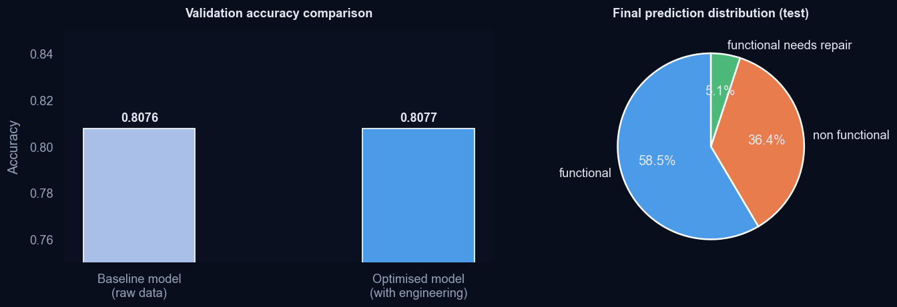

---

## Project Architecture

```
┌─────────────────────────────────────────────────────────────────────────┐
│                        DATA SOURCES                                     │
│          DrivenData — Pump It Up: Data Mining the Water Table           │
│     train_features.csv · train_labels.csv · test_features.csv           │
└────────────────────────────┬────────────────────────────────────────────┘
                             │
                             ▼
┌─────────────────────────────────────────────────────────────────────────┐
│                  EXPLORATORY DATA ANALYSIS (EDA)                        │
│                                                                         │
│   ┌─────────────────┐   ┌──────────────────┐   ┌──────────────────┐     │
│   │ Class imbalance │   │ Missing values   │   │ Geographic       │     │ 
│   │ analysis        │   │ & zero-masking   │   │ distribution     │     │
│   └─────────────────┘   └──────────────────┘   └──────────────────┘     │
│   ┌─────────────────┐   ┌──────────────────┐                            │
│   │ High-cardinality│   │ Categorical vs   │                            │
│   │ variables       │   │ target patterns  │                            │
│   └─────────────────┘   └──────────────────┘                            │
│                                                                         │
│   Automated report: Sweetviz HTML · Agentic EDA: LangGraph + Claude     │
└────────────────────────────┬────────────────────────────────────────────┘
                             │
                             ▼
┌─────────────────────────────────────────────────────────────────────────┐
│                     FEATURE ENGINEERING                                 │
│                                                                         │
│  pump_age · log_population · log_amount_tsh · region_fail_rate          │
│  qty_pay_combo · has_scheme_mgmt · construction_decade                  │
│  Top-50 cardinality reduction · Train-only imputation medians           │
└────────────────────────────┬────────────────────────────────────────────┘
                             │
                             ▼
┌─────────────────────────────────────────────────────────────────────────┐
│                        MODELLING                                        │
│                                                                         │
│  ┌──────────────┐  ┌──────────────┐  ┌──────────────┐                   │
│  │ Random       │  │ Extra Trees  │  │ Gradient     │                   │
│  │ Forest       │  │              │  │ Boosting     │                   │
│  └──────┬───────┘  └──────┬───────┘  └──────┬───────┘                   │
│         └─────────────────┼─────────────────┘                           │
│                           │ Stacking Ensemble                           │
│                           ▼                                             │
│              ┌────────────────────────┐                                 │
│              │  LogisticRegression    │                                 │
│              │  Meta-learner (OOF)    │                                 │
│              └────────────────────────┘                                 │
│                                                                         │
│  Minority class strategies: threshold tuning · two-stage model          │
│  cost-sensitive learning · weighted voting ensemble                     │
└────────────────────────────┬────────────────────────────────────────────┘
                             │
                             ▼
┌─────────────────────────────────────────────────────────────────────────┐
│                     EVALUATION & OUTPUT                                 │
│                                                                         │
│   Accuracy · Macro-F1 · Recall(functional needs repair)                 │
│   submission_*.csv  →  DrivenData leaderboard: 0.8230                   │
└─────────────────────────────────────────────────────────────────────────┘
                             │
                             ▼
┌─────────────────────────────────────────────────────────────────────────┐
│              INTERACTIVE LAYER (Gradio + Claude)                        │
│                                                                         │
│   Annex B: EDA Explorer & Individual Prediction (port 7860)            │
│   Annex C: "Ask the Project" — conversational AI assistant (port 7862) │
└─────────────────────────────────────────────────────────────────────────┘
```

---

## Repository Structure

```
MachineLearning_Pipeline_WaterInfrastructure_Agentic_EDA/
│
├── pump_it_up.ipynb              # Main notebook — full ML pipeline + Annex B & C
├── ib_style.py                   # Brand styling module (plots, Gradio themes, HTML reports)
│
├── train_test_data/              # Competition data (not tracked by Git)
│   ├── train_features.csv
│   ├── train_labels.csv
│   ├── test_features.csv
│   └── submission_format.csv
│
├── submissions/                  # Generated prediction files
│   ├── submission_modelo_base.csv
│   ├── submission_pump_it_up.csv
│   ├── submission_stacking.csv
│   ├── submission_threshold.csv
│   ├── submission_dos_etapas.csv
│   ├── submission_cost_sensitive.csv
│   └── submission_ensemble_votacion.csv
│
├── images/                        # Figures generated by the notebook
│   ├── fig_target_distribution.png
│   ├── fig_missings.png
│   ├── fig_cat_stacked.png
│   ├── fig_cat_vs_target.png
│   ├── fig_geo.png
│   ├── fig_numeric_distributions.png
│   ├── fig_num_anomalies.png
│   ├── fig_pump_age_distribution.png
│   ├── fig_feature_importance_baseline.png
│   ├── fig_feature_importance_optimized.png
│   ├── fig_feature_importance_interp.png
│   ├── fig_low_importance.png
│   ├── fig_automl_comparison.png
│   ├── fig_cm_baseline.png
│   ├── fig_cm_comparison.png
│   ├── fig_model_comparison.png
│   ├── fig_stacking_comparison.png
│   ├── fig_threshold_tuning.png
│   ├── fig_repair_recall_comparison.png
│   ├── fig_ensemble_votacion.png
│   └── fig_summary.png
│
├── .env                           # API key — never committed to Git
├── .gitignore                     # Excludes .env, data, outputs
└── README.md
```

> **Note:** `train_test_data/` and `.env` must be added to `.gitignore` and are not included in this repository. `ib_style.py` must sit in the same folder as the notebook — if it's missing, the notebook falls back to default (unstyled) plots without breaking.

---

## Recommended `.gitignore`

```gitignore
# Environment variables — never commit API keys
.env

# Competition data
train_test_data/

# Notebook outputs and checkpoints
.ipynb_checkpoints/
__pycache__/

# Generated HTML reports
eda_report_*.html

# OS files
.DS_Store
Thumbs.db
```

---

## Project Overview

This project focuses on predictive analytics and machine learning applied to water infrastructure management using real-world operational data from Tanzania.

The objective is to predict the operational status of water pumps using technical, geographical and administrative variables in order to support maintenance prioritization, operational efficiency and infrastructure reliability.

The project simulates a real-world predictive maintenance scenario commonly found in enterprise environments, combining exploratory analysis, feature engineering, model optimization, business-oriented interpretation of results, and an AI-powered interactive layer for non-technical stakeholders to explore the findings.

---

## Business Problem

Thousands of water pumps across Tanzania operate under limited maintenance resources and difficult geographical conditions. Incorrectly identifying pumps that require maintenance may result in loss of water access for communities, increased operational costs, delayed infrastructure interventions, and resource allocation inefficiencies.

The goal is to develop a machine learning solution capable of identifying pumps at risk of failure before becoming completely non-operational — and to make that solution accessible to non-technical stakeholders through interactive tools.

---

## Dataset Overview

The dataset contains operational and administrative information for over 59,000 water pumps installed across Tanzania.

### Target Variable

| Status | Description |
|---|---|
| Functional | Pump operates correctly |
| Non Functional | Pump is completely out of service |
| Functional Needs Repair | Pump works but requires maintenance |

---

## Methodology

The project follows a CRISP-DM inspired workflow commonly used in enterprise Data Science environments.

### 1. Exploratory Data Analysis (EDA)

Main challenges identified during analysis:

**Imbalanced target classes**

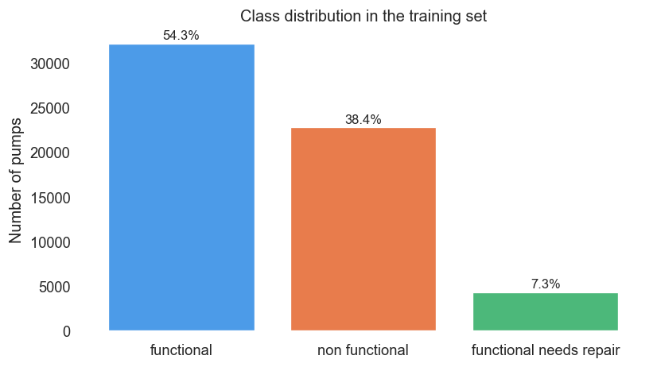

**Missing values represented as zeros**

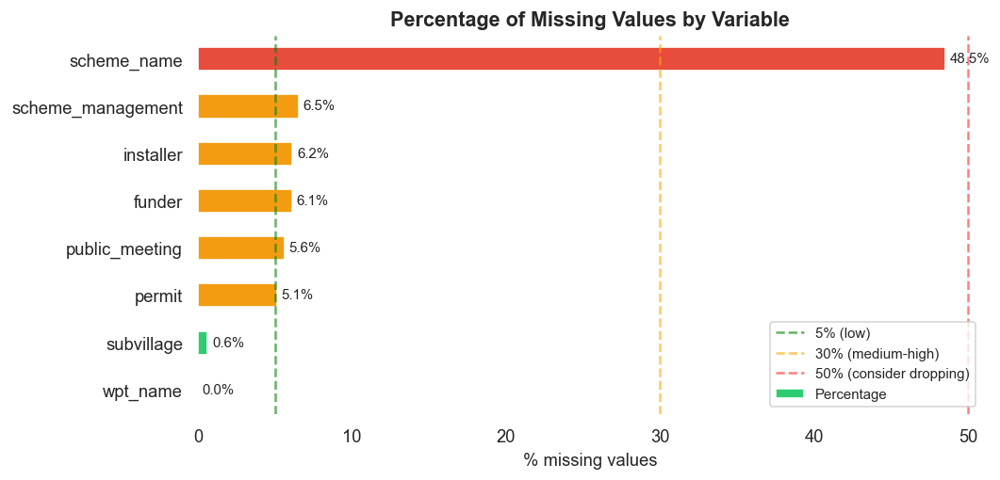

**High-cardinality categorical variables**

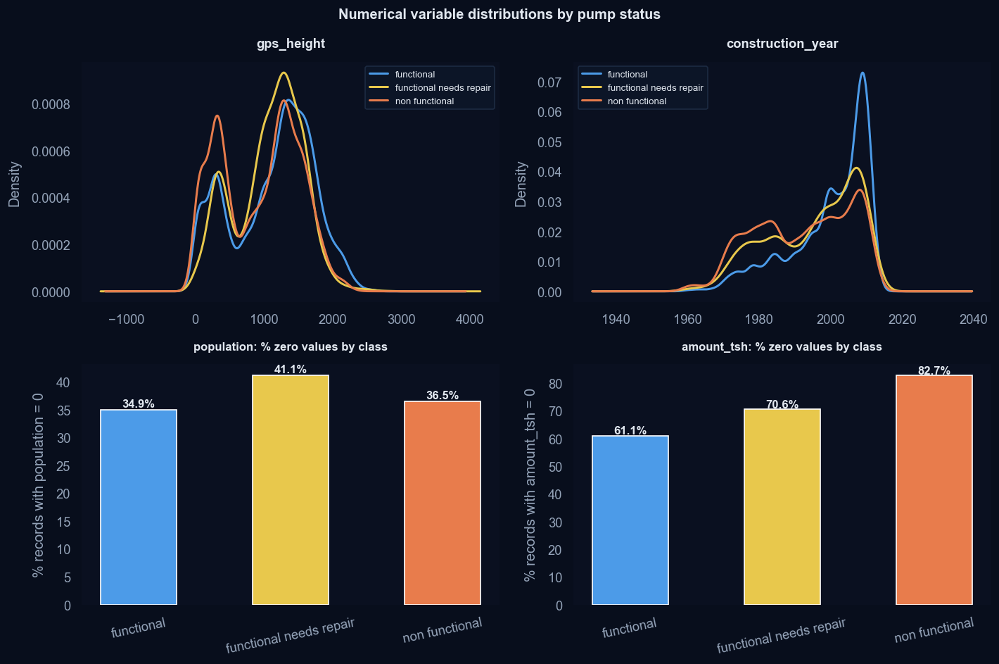

**Strong geographical patterns**

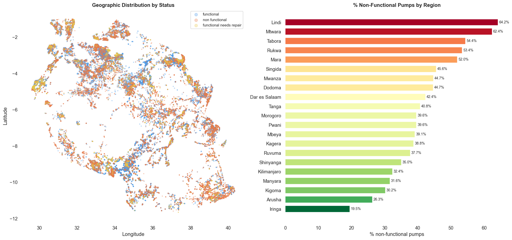

**Sparse maintenance information**

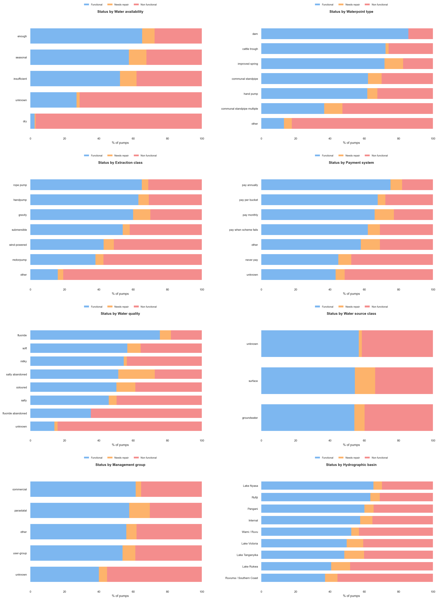

An automated **Sweetviz** HTML report and an **agentic EDA pipeline (LangGraph + Claude)** were also produced, allowing the dataset to be explored and summarized through natural-language queries.

---

### 2. Data Preparation & Feature Engineering

Several transformations were implemented to improve predictive performance and reduce data noise. All imputation statistics (medians, target-encoding maps, cardinality vocabularies) are fit exclusively on the training set to prevent data leakage.

#### Feature Engineering

| Feature | Type | Business Purpose |
|---|---|---|
| `pump_age` | Derived | Infrastructure aging analysis |
| `construction_decade` | Derived | Technological lifecycle segmentation |
| `log_population` | Transformed | Population normalization (skew reduction) |
| `log_amount_tsh` | Transformed | Flow normalization (skew reduction) |
| `region_fail_rate` | Target encoded | Regional failure risk estimation |
| `qty_pay_combo` | Interaction | Water availability vs payment behaviour |
| `has_scheme_mgmt` | Binary flag | Operational governance indicator |

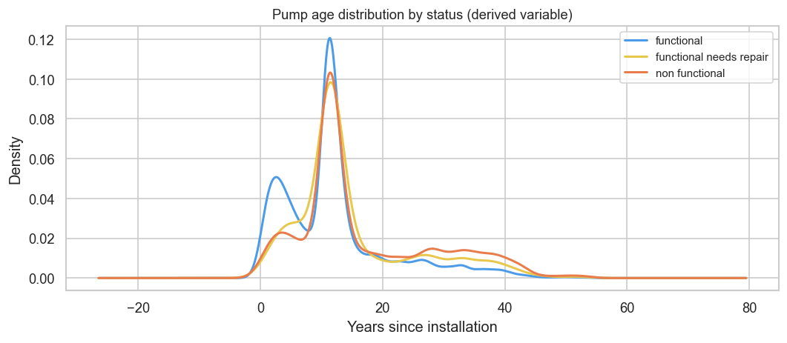

#### Cardinality Management

High-cardinality variables (`funder`, `installer`, `lga`) are reduced to their Top-50 most frequent values; all others are mapped to `other` before encoding. Columns with extreme cardinality and low net gain (`wpt_name`, `subvillage`, `ward`, `scheme_name`) are dropped.

---

### 3. Machine Learning Models

Multiple machine learning approaches were evaluated and compared:

- Random Forest (baseline and optimised)
- Extra Trees
- Gradient Boosting
- HistGradientBoosting
- AutoML (RandomizedSearchCV)
- Stacking Ensemble (RF + ET + GBT → LogisticRegression meta-learner)
- Cost-sensitive learning strategies

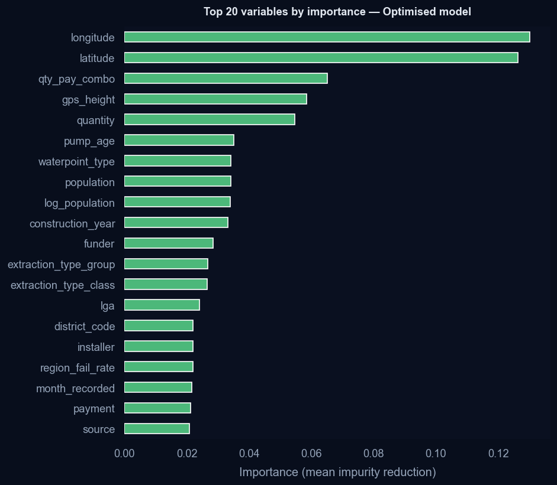


#### Minority Class Strategies

Given the operational criticality of `functional needs repair` (only 7.3% of the dataset), four dedicated strategies were evaluated:

| Strategy | Approach |
|---|---|
| Threshold tuning | Lower decision boundary for minority class |
| Two-stage model | Binary split then specialised sub-classifier |
| Cost-sensitive learning | Higher misclassification penalty for minority class |
| Weighted voting ensemble | Combines all five submission files with class-specific weights |

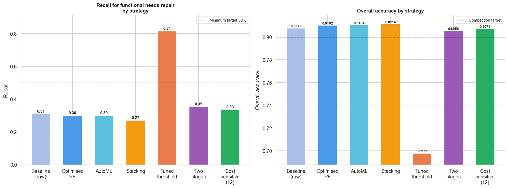

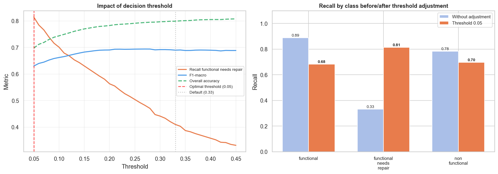

---

## Model Performance

All models below are compared on the same validation split (Accuracy). Macro-F1 and Recall (functional needs repair) are reported where computed during evaluation.

| Model | Accuracy |
|---|---|
| Random Forest Baseline | 0.8076 |
| Optimised Random Forest | 0.8102 |
| AutoML (RandomizedSearchCV) | 0.8104 |
| Stacking Ensemble | 0.8114 |

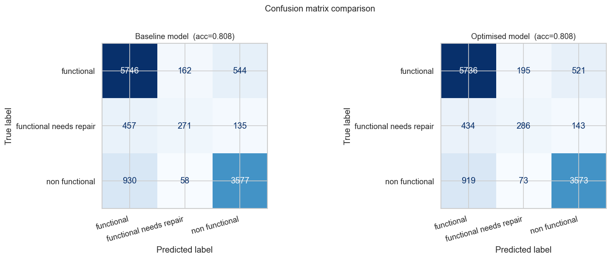

### Final Model — Weighted Voting Ensemble

| Metric | Value |
|---|---|
| DrivenData leaderboard score (Accuracy) | **0.8230** |
| Macro-F1 | *(pending — add from notebook evaluation cell)* |
| Recall (functional needs repair) | *(pending — add from notebook evaluation cell)* |

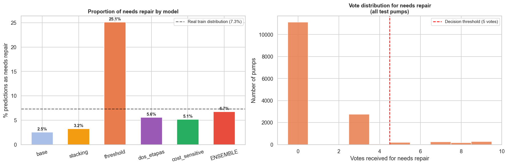

---

## Key Business Insights

### 🌍 Geographic Risk Patterns

Southern regions such as Lindi and Mtwara present significantly higher failure rates compared to northern areas. This suggests strong correlations between infrastructure reliability, regional investment and operational accessibility.

### 🔧 Infrastructure Aging

Older pumps show substantially higher failure probability, particularly installations older than 20 years. This enables predictive maintenance prioritization based on infrastructure lifecycle.

### 💧 Water Availability & Failure Correlation

Pumps operating in low-water regions are considerably more likely to become non-functional. This may reflect both environmental stress and reduced maintenance incentives.

### 💰 Financial Sustainability Impact

The absence of payment systems strongly correlates with infrastructure failure. Communities without maintenance funding mechanisms experience significantly higher operational degradation.

### 🏢 Operational Management Quality

Infrastructure managed by undefined or weak governance entities demonstrates worse operational performance than systems managed by formal organizations.

---

## Technical Skills Demonstrated

- Machine Learning & Predictive Analytics
- Feature Engineering & Data Cleaning
- Exploratory Data Analysis (EDA)
- Ensemble Models & Stacking
- Imbalanced Dataset Handling
- Agentic AI Pipelines (LangGraph + Claude)
- Interactive Demos & Conversational Interfaces (Gradio + Anthropic API)
- Classification & Business Intelligence Interpretation
- Python Data Stack (pandas, numpy, sklearn, matplotlib, seaborn)

---

## Setup & Reproducibility

### Requirements

```bash
pip install -r requirements.txt
```

### Environment Variables

This project requires an Anthropic API key for the agentic EDA (LangGraph) and the "Ask the Project" assistant (Annex C). Create a `.env` file in the project root:

```
ANTHROPIC_API_KEY=your_api_key_here
```

The key is loaded automatically by the notebook via `python-dotenv`. It is never stored in the code.

### Running the Notebook

1. Clone the repository
2. Make sure `ib_style.py` is in the same folder as `pump_it_up.ipynb` (provides the visual styling for all plots and the Gradio interfaces)
3. Place the competition CSV files in `train_test_data/`
4. Create your `.env` file with your API key
5. Run `pip install -r requirements.txt`
6. Open `pump_it_up.ipynb` and run all cells in order

### Launching the Interactive Demos

Running the notebook's final cells launches two local Gradio apps:

- **Annex B** — `http://127.0.0.1:7860` — EDA Explorer and individual pump prediction
- **Annex C** — `http://127.0.0.1:7862` — "Ask the Project" conversational assistant (requires `ANTHROPIC_API_KEY`)

---

## Strategic Conclusions

The project demonstrates how machine learning — combined with an AI-powered interactive layer — can support predictive maintenance and operational optimization in large-scale infrastructure environments.

Beyond model accuracy, the analysis highlights how geographical, operational and financial factors directly influence infrastructure reliability, and how conversational AI tools can make those findings accessible to non-technical stakeholders for more proactive, data-driven decision making.

**Potential extensions:** risk-based maintenance scheduling, regional infrastructure investment planning, governance optimization, and further modeling improvements (geospatial clustering, gradient boosting frameworks, calibrated ensemble architectures).
